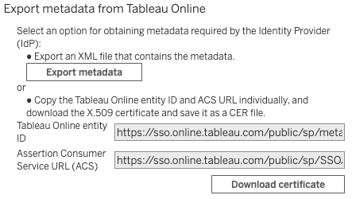

# Tableau and the Okta apps

## **Scope**

The testing focuses on the integrations between Tableau Online and Okta for SAML authentication. This is the core SAML authentication functionality to get a user securely logged on, not advanced configuration or user provisioning.

### **Okta Applications**

There are two published apps in the [Okta Integration Network \(OIN\)](https://help.okta.com/en/prod/Content/Topics/Apps/Apps_Apps.htm). One for Tableau Online \(TOL\) and the other for Tableau Server. They have a different SAML feature set which you need to be aware of. The Okta Tableau Online application supports the following three SAML features.

1. SP-initiated SSO
2. IdP-initiated SSO
3. SP-Initiated Single Logout \(SLO\)
4. **SCIM user provisioning**

It is not just authentication the TOL app provides but also it has [SCIM for user provisioning](https://help.tableau.com/current/online/en-us/scim_config_online.htm).

The Tableau Server Okta App supports the same features **apart** from SCIM. Also note neither apps support _IdP-initiated SLO._ _\*\*_

#### Okta Developer Tenant

Sign up for an Okta Developer Tenant. The tenant is permanent and will allow you to test out all the features you need: [https://developer.okta.com/signup/](https://developer.okta.com/signup/)

### **Documentation**

I don't want to duplicate setup instructions here as Okta and Tableau docs do a good job. To be honest I found the Okta instructions better than the Tableau Online ones as they had screenshots. However the Okta Tableau Server ones look out of date.

**Okta Resources: Setup**  
[How to Configure SAML 2.0 for Tableau Online](https://saml-doc.okta.com/SAML_Docs/How-to-Configure-SAML-2.0-for-Tableau-Online.html)  
[How to Configure SAML 2.0 for Tableau Server](https://saml-doc.okta.com/SAML_Docs/How-to-Configure-SAML-2.0-for-Tableau-Server.html) -&gt; _this has out of date screenshots - pre-TSM_  
**Tableau Resources: Setup**  
[Configure SAML with Okta](https://help.tableau.com/current/online/en-us/saml_config_okta.htm) - Tableau Online  
[SAML](https://help.tableau.com/current/server/en-us/saml.htm) - Tableau Server general SAML guidance

### **Configuration**

The key setup configuration items for SAML are described below, I tested TOL but have included some information such as the Return URL and Certificates which are only required by a Tableau Server deployment. Surprisingly, Okta does not require \(or support\) the uploading of the Service Provider Metadata to complete the configuration using metadata exchange, so you have to input details manually.

<table>
  <thead>
    <tr>
      <th style="text-align:left">Product</th>
      <th style="text-align:left"><b>Configuration</b>
      </th>
      <th style="text-align:left">Description</th>
    </tr>
  </thead>
  <tbody>
    <tr>
      <td style="text-align:left">Tableau Online</td>
      <td style="text-align:left"><b>SAML entity ID</b>
      </td>
      <td style="text-align:left">The entity ID uniquely identifies your Tableau Server installation to
        the IdP. It represents a system entity in metadata, which is a SAML service,
        such as an IdP or an SP as you could have multiple listed in the metadata.
        The value of the entityID attribute SHOULD be the canonical URL of the
        entity&apos;s metadata document. An example from TOL: <b>entityID=&quot;</b> 
        <a
        href="https://sso.online.tableau.com/public/sp/metadata?alias=4b728bd1-df88-xxxx-xxxx-xxxxxxxxxxxx">https://sso.online.tableau.com/public/sp/metadata?alias=4b728bd1-df88-xxxx-xxxx-xxxxxxxxxxxx</a><b>&quot;</b>
      </td>
    </tr>
    <tr>
      <td style="text-align:left">Tableau Online</td>
      <td style="text-align:left"><b>Assertion Consumer Service (ACS) URL</b>
      </td>
      <td style="text-align:left">Service Providers support SSO protocols by including one or more endpoint
        elements in their metadata. These are the locations to which the IdP will
        eventually send the user at the SP. By enumerating them in the metadata,
        the IdP can ensure that the user&apos;s information is sent only to authorized
        locations. An example from TOL: <b>Location=&quot;</b><a href="https://sso.online.tableau.com/public/sp/SSO/4b728bd1-df88-xxxx-xxxx-xxxxxxxxxxxx">https://sso.online.tableau.com/public/sp/SSO/4b728bd1-df88-xxxx-xxxx-xxxxxxxxxxxx</a><b>&quot;</b>
      </td>
    </tr>
    <tr>
      <td style="text-align:left">Tableau Online</td>
      <td style="text-align:left"><b>IdP Metadata XML file</b>
      </td>
      <td style="text-align:left">SAML metadata is configuration data required to automatically negotiate
        agreements between system entities, comprising identifiers, binding support
        and endpoints, certificates, keys, cryptographic capabilities and security
        and privacy policies. You will download this from the Okta portal.</td>
    </tr>
    <tr>
      <td style="text-align:left">Tableau Server</td>
      <td style="text-align:left"><b>Return URL</b>
      </td>
      <td style="text-align:left">The URL that Tableau Server users will access, such as <code>https://tableau-server</code>.
        Using <code>https://localhost</code> or a URL with a trailing slash <code>http://tableau_server/</code> is
        not supported.</td>
    </tr>
    <tr>
      <td style="text-align:left">Tableau Server</td>
      <td style="text-align:left"><b>SAML Certificate and key files</b>
      </td>
      <td style="text-align:left">
        
Tableau Server requires a certificate-key pair to encrypt the traffic,
          sign the request that is sent to the IdP and encrypt assertions. There
          are <a href="https://help.tableau.com/current/server/en-us/saml_requ.htm#certificate-and-identity-provider-idp-requirements">Certificate Requirements</a> listed
          which are specific so need to be followed carefully.

        
One thing to be aware of is that by default Tableau Server currently uses
          SHA-1 signature algorithm. Many IdP&apos;s will have SHA256 as standard.
          You can also change to SHA256 by running the following TSM command: <code>tsm configuration set -k wgserver.saml.sha256 -v true</code>
        

      </td>
    </tr>
  </tbody>
</table>

### Validation Tests

After completing any configuration I usually go through and write validation tests to confirm the setup is working as expected. This was how I found the lack of support for SLO mentioned above. Here are the tests I completed as a starting point.

| **Test** | **Actions** | **Result** |
| :--- | :--- | :--- |
| Tableau Sign in with SAML user | Add username and select Sign In Redirect to Okta to insert password Redirected in to TOL | Success |
| Okta Sign in with SAML user | Sign in to Okta with credentials.  Click on Tableau Online and enter portal | Success |
| Sign in with MFA | MFA enforced by Okta policy | Success |
| Sign out from Okta | Select sign out from app in Okta | Failed: Expected to fail as IdP-initiated SLO not supported |
| Sign out from Tableau | Go to Tableau user profile Select Sign out | Success |
| Sign in with Local user from Tableau | Go to Tableau sign in, login with local user | Success: login and no redirection to Okta |

### Summary

It is simple to get up and running with Tableau and Okta using the provided apps from Okta for both Tableau Online and Server. The key point to understand are the features provided by each app. The Tableau Online app provides support for SCIM user and group provisioning. The Tableau Server app purely delivers SAML authentication \(no SCIM\), neither apps support IdP-Initiated SLO.

