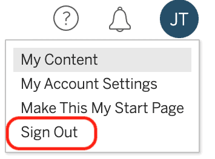

# Recipe: SAML with Onelogin

My goal is to setup OneLogin as the Identity Provider for Tableau Server. I want to synchronise users from Active Directory to Tableau and OneLogin;  then use those accounts to sign in with SAML to Tableau. Simple, right?

### OneLogin Developer Tenant

First off, sign up for a free OneLogin developer account. This gives me the ability to test out all the features I need.



### Tableau Server Identity Store

During Tableau setup I have configured Active Directory as the External Identity store. So before I can authenticate with a user, I need to ensure there is actually a user account created within Tableau. I used the [Tableau AD Users and Group Sync ](https://help.tableau.com/current/server/en-us/users_manage_ad.htm)to import _Adam.Wally_ from Active Directory. The Tableau username is based on the `sAMAccountName` attribute in AD:


So when imported:


As described [here](https://help.tableau.com/v2020.4/server/en-us/security_auth.htm)...If you configure Tableau Server to use Active Directory during installation, then NTLM will be the default user authentication method. So my test with `Adam.Wally` proved I could authenticate with my AD username and password.

### Active Directory and OneLogin Directories

I did not want to manually populate OneLogin with user accounts, so I saw they had an [Active Directory Connector](https://onelogin.service-now.com/kb_view_customer.do?sysparm_article=KB0010442) and decided to use that.

The Active Directory Connector was straightforward to download and setup. The connections were all outbound so in my lab it just worked straight away, you know how labs do. However, in an Enterprise you will need to configure the network security for your proxy or egress. So for any OneLogin agent, domains, ip addresses and ports are listed [here](https://onelogin.service-now.com/support?id=kb_article&sys_id=e1899821db8c60103de43e0439961952&kb_category=a0b5e130db185340d5505eea4b961957)... _Use **IP whitelisting** for on-premises agents, like Active Directory Connector_


Once downloaded the setup is simple. I chose the Create OneLogin Service Account option by inputting a password to setup the account via the wizard.


_...It creates a domain service account named OneLoginADC with Builtin\Administrators credentials in the local Domain..._ This was fine in my lab but I would follow the principle of least privilege in production and there is an article to guide you on how to [Create a Domain Service Account to run Active Directory Connector](https://onelogin.service-now.com/support?id=kb_article&sys_id=e73c3a35dbf0441024c780c74b961909).

The ADC Setup also configures OneLogin Desktop SSO feature, now called [Windows Domain Authentication](https://onelogin.service-now.com/kb_view_customer.do?sysparm_article=KB0010313). This allows for Integrated Windows Authentication if you require it for Windows and Mac desktops. Not a feature I required in my scenario but a default part of the ADC setup.


The setup is a little confusing here, as it refers to selecting the domains, but also includes the Users container. I just followed with the choice as is.


Once the setup is complete you go back to the OneLogin portal and is gives you the option to select the OU's/Containers that you would like to synchronise. Always, when I am testing a directory sync I start small. I know I only have 100 test users in my OU so know this should be a pretty quick exercise. I have seen many customers try to sync their entire domain and get into issues with large directories. Start small, test early and then incrementally add if you have 1000s of objects.


Even though the ADC sync was communicating with the Onelogin service. I did not have any new users in the directory. When I check the logs in `C:\Program Data\OneLogin, Inc\logs` I was getting an error about missing attributes.


The attributes shown below are required and luckily I knew straight away that my lab users didn't have an email address. 


I added the email address for one of my AD users re-synced and away we went!


So the synchronisation is working, now I just need to setup SAML to test signing in with this user.

### Tableau Server-Wide SAML setup

The standard setup instructions for Tableau Server are below:



The obvious steps apply of defining your entity ID, uploading certificates and sharing of metadata between Tableau as the service provider and OneLogin as the Identity Provider.


#### Certificates:

I chose to use the same certificates I used for the Server SSL.

In addition to [all the normal requirements](https://help.tableau.com/current/server/en-us/saml_requ.htm#Certific) for your SSL certificate you [also need to ensure that](https://help.tableau.com/current/server/en-us/saml_requ.htm#Cert_Name) your certificate for SAML only includes the certificate that applies to Tableau Server and not any other certificates or keys.

### Onelogin Apps and SAML

There are a lot of Tableau apps in the Onelogin directory. I selected the **Tableau Server SAML 2.0** app. _This was my first mistake ;\)_


Once installed I was looking for an option to upload metadata but there isn't \(similar to Okta\). So the only option I had was to define the Server Name and protocol, it seemed strange as normally I would have to input the Entity ID **and** ACS when configuring Tableau Online with an IdP, but I ploughed on regardless _\(mistake \#2\)_.


The default settings for SAML 2.0, included a Standard Strength Certificate and SHA-1 signing algorithm. All of this information I was able to download in the metadata and then import into Tableau.


The user attribute mappings are pretty simple for Tableau.


After uploading the metadata I applied the pending changes in Tableau which required a service restart. I love 'em. I wanted to test a basic SAML configuration without adding in things like SLO or different client SAML options.


The services restarted and I attempted my first sign in and... FAIL!  
The error I was getting was:


I attempted both an IdP-initiated sign on and SP-initiated and got the same error.

### Troubleshooting

I reset the password in OneLogin and checked that I could sign in. I checked the account in OneLogin and I made sure that I was 'Authenticated by' OneLogin and **not** Active Directory. If it was set to Active Directory I would have had to have used my AD username and password to sign in.


In Tableau I wanted to check the usernames in the Identity Store. Weirdly, I couldn't find a simple way to do this, as I had enabled Server-Wide SAML and was automatically being redirected to the OneLogin portal for all authentication requests. I looked at using **tabcmd** but couldn't see an obvious cmd that just listed users \(maybe I missed something\). Also TSM doesn't contain user information it is only the higher-level server configuration that is managed from the portal. 

I found these [instructions](https://kb.tableau.com/articles/howto/exporting-user-list) to access the Server Repository which is a PostgreSQL database. This is a lot of work but I found it useful to look at the underlying database. A quicker method with no server restart would be to connect via the [REST API](https://help.tableau.com/current/api/rest_api/en-us/REST/rest_api_get_started_tutorial_intro.htm) and get the information. 

I had to ensure I had network access on port 8060 and run a tsm command first as explained [here](https://help.tableau.com/current/server/en-us/perf_collect_server_repo.htm).


Once I had connected I could then browse the \_users table:


I checked I was passing the value in the Name column as the username attribute in SAML \(_adam.wally_\). This corresponds with the sAMAccountName shown at the top of the article in AD and mapped in OneLogin. I'm a big fan of [SAML-tracer for Firefox](https://addons.mozilla.org/en-US/firefox/addon/saml-tracer/) and Chrome. This showed I was passing the correct attribute:


The next step was to look at the logs on the Tableau side to see if there was anything obvious reported. 



To log SAML-related events, `vizportal.log.level` must be set to `debug`. For more information, see [Change Logging Levels](https://help.tableau.com/current/server/en-us/logs_debug_level.htm).

```text
tsm configuration set -k vizportal.log.level -v debug
tsm pending-changes apply

tsm configuration set -k vizportal.log.level -d
tsm pending-changes apply
```

Check for SAML errors in the following files in the unzipped log file snapshot:`\vizportal\vizportal-<n>.log`


I did some searching for the error message but I wasn't clear what Audiences was referring to. I then did what I probably should have done at the start and seen if someone else had already set this up. I found this [great article](https://medium.com/@kannanmadhav/configuring-saml-for-tableau-server-with-onelogin-3e9a58cb2931) by a colleague of mine Madhav Kannan that identified my issue. At the very start I had chosen the wrong OneLogin Tableau app. I need to have chosen **Tableau Server\(Signed Response\)**.  


This allows me to configure what OneLogin refers to as the SAML [Audience](https://support.okta.com/help/s/article/Common-SAML-Terms?language=en_US), but we reference as the value  **Entity ID**.


So this time the OneLogin app makes more sense.


### Client Exceptions

I mentioned earlier that with Server-Wide SAML configured every user had to authenticate using SAML, there is no mixed authentication methods. However, there is an interesting feature within the SAML configuration that allows you to apply exceptions for both the Desktop and Mobile client.


When I choose to sign in to the Tableau Server using the desktop client I get challenged by the normal SAML flow \(shown below\).


By **deselecting** the SAML sign in from Tableau Desktop the flow reverts to the username/password or NTLM AuthN. 

Unfortunately it requires a server restart so go get a cup of tea.


After the restart you will see that the login prompt has changed from being redirected to your SAML IdP, to the normal Tableau server prompt. You will then be able to sign in with your AD/LDAP credentials or Tableau Local username and password. 


### Single Logout

After logging on to the server I noticed I did not have option to sign out of Tableau. Tableau Server and Tableau Online supports Single Logout \(SLO\) for server-wide SAML \(only SP-initiated not IdP-initiated\). If you have configured Site SAML in Tableau Server neither SP or IdP-initiated are supported.

This feature is enabled by importing the SAML SLO Endpoint as part of the OneLogin IdP metadata. However despite uploading the correct metadata it was not available:


Looking at the OneLogin metadata XML below you can see there are different HTTP methods defined for SLO and SSO, _redirect_ and _post_ respectively.


As our [SAML Requirements](https://help.tableau.com/current/server/en-us/saml_requ.htm#xml_requirements) documentation states... ****_**HTTP POST**: Tableau Server accepts only HTTP POST requests for SAML communications. HTTP Redirect is not supported._ Unfortunately this means SLO is not currently going to work with OneLogin.

#### **How it should work:**



### Conclusion

#### OneLogin

Getting Active Directory sync'ed up to OneLogin was surprisingly easy in my little lab which is a good sign. I like the outbound ADC agent, \(similar to the Azure connectors\) in not requiring reverse proxies. Naturally it would take a lot more planning in an Enterprise but if you get stuck in a lab that would be more concerning. The number of Tableau apps in OneLogin is confusing so pay attention and pick the right one, ...do what I say not what I do! 

#### SAML

If you setup Server Wide SAML then know that it means **all accounts** and you can't login with any other AuthN method. So, ensure all necessary accounts are sync'ed into your IdP \(such as admins\) or be ready to disable SAML for a workaround. 

#### **Single Logout**

With the lack of Single Logout, I don't see this as an issue for many users where speed is important by just closing a browser; but with more advanced users who are used to signing out as good practice this may come as a surprise. However, this does highlight a risk around [session hijacking ](https://owasp.org/www-community/attacks/Session_hijacking_attack)particularly in shared computer or embedded scenarios. Standard mitigations for this would be configuring the browser or running a job to regularly delete persistent cookies and session cookies, and then use threat detection and security in depth with TLS and anti-malware. Commonly these cookie attacks are part of phishing scams so user education is important to recognize the warning signs.


